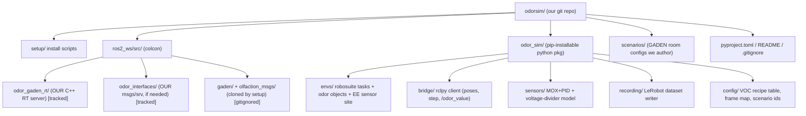
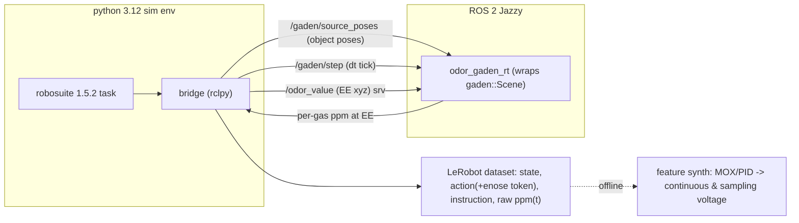

# GADEN + robosuite 1.5.2 Co-simulation for Odor VLA Data

## Scope corrections from review

- The old `simulation/` folder was a throwaway playground: **do not copy it**. We selectively re-derive only the useful bits (the **RM65 custom robot** definition + the GADEN setup script) into clean packages.
- **Drop LIBERO.** It targets py3.8/old robosuite and `lerobot-libero` needs robosuite 1.4.0. We standardize on **robosuite 1.5.2** on Python 3.12 and author tasks ourselves, attaching our own language instructions (all the VLA needs).
- Deliverable is a **proper, replicable git repo**: a setup script clones GADEN and builds everything so a fresh machine can reproduce the environment.

## Working agreement (build -> test -> confirm)
Incremental, user-verified delivery. After finishing each phase (or a meaningful sub-step), I will:
1. Stop - do NOT start the next phase automatically.
2. Give a short, copy-pasteable **test procedure** (exact commands + what a PASS looks like) so the user can verify it themselves.
3. Wait for the user's explicit "passed / go on" before continuing. If it fails, fix and re-test first.
Keep changes per step small enough to test in isolation.

## Research framing (paper thesis)

Goal: show that **this pipeline lets a VLA fuse an extra sensor modality (odor/e-nose) and expand its task ability with that sense.** That claim is made by **ablation**, so the whole design must make these three variants a config switch over one dataset/schema:

- **No-odor baseline**: vision + proprio only (should fail odor-dependent tasks).
- **Continuous odor**: always-on e-nose voltage in the observation.
- **Active/sampling odor**: e-nose reads ~~baseline until the policy emits a *smell* action, then samples for a fixed window (~~7 s) to produce a classification signal.

### Two e-nose paradigms, one recording (key architectural decision)

A physical MOX/e-nose is *either* always-exposed *or* valve-gated - you cannot literally record both operating modes in one rollout. Resolution: **always record the ground-truth per-gas concentration time series ppm(t) at the EE** (from GADEN), and treat every sensor mode as a deterministic post-hoc function of ppm(t) + the enose action schedule. Then we can synthesize BOTH streams from the same rollout and store them separately:

- **Continuous voltage stream**: MOX/PID dynamic response to always-exposed ppm(t), every control step.
- **Sampling voltage stream**: same model but *gated* by the enose action - held at baseline except during sample windows; a `filter`/purge state actively decays toward baseline.

Because both derive from stored ppm(t), we never have to commit now to which paradigm the paper uses.

### Odor classification needs a time window (not one step)

One instantaneous voltage cannot identify an odor; the discriminative information is in the **transient** (GADEN's MOX model already simulates rise/decay via tau + low-pass filter, see [fake_gas_sensor.cpp](../gaden/simulated_gas_sensor/src/fake_gas_sensor.cpp)). So we **store the time series and form windows at the model layer**, not at capture:

- Continuous policy: feed a **stacked last-K-steps** voltage (short history) in the observation.
- Sampling policy: feed the **whole sample-window trace** (or features/embedding of it) when a sample completes.
Both are adapter-level transforms over the same recorded ppm(t)/voltage series (Phase 6), consistent with the "capture a superset, adapt at train time" rule.

### Action space (unified across paradigms)

Extend the action with an optional **enose head**: `enose_state in {-1: filter/purge, 0: idle, 1: sample}`. Plumbing/sampling action looks like `[x, y, z, roll, pitch, yaw, gripper, enose_state]`.

- **Sampling mode**: the enose head is a real ternary output the VLA learns.
- **Continuous mode**: there is no smell decision - the odor is a pure always-on *observation*; the enose head is simply fixed to `1` (or dropped by the adapter). Same schema, one dim ignored.
So we always *record* the enose dim; each experiment's adapter decides whether the policy predicts it or it is constant.

## Core insight (unchanged - why a new C++ node)

GADEN's stock pipeline (`gaden_filament_simulator` -> `gaden_player` -> `/odor_value`) **bakes source positions into pre-saved snapshots**, so it cannot move a source the robot picks up. Live moving sources + point queries exist only in GADEN's real-time C++ core:

- `gaden::Scene` from `RunningSceneMetadata` advances N live sims and answers `SampleConcentrations(point)` -> per-gas ppm ([Scene.hpp](gaden/gaden_common/third_party/gaden_core/include/gaden/Scene.hpp)).
- Each sim's source position is a public mutable field `simulationMetadata.source->sourcePosition` ([GasSource.hpp](gaden/gaden_common/third_party/gaden_core/include/gaden/datatypes/sources/GasSource.hpp)); `PointSource::Emit()` just returns it ([PointSource.hpp](gaden/gaden_common/third_party/gaden_core/include/gaden/datatypes/sources/PointSource.hpp)).
- The `gaden_py` cppyy bindings are unusable here (cppyy/cling absent), so we wrap the core in a small **C++ ROS 2 node**, not Python.

Robot motion doesn't affect the plume and wind is uniform, so one lightweight live sim per source is cheap at 20 Hz.

## Layout note (implementation deviation, agreed)
GADEN is kept **cloned in-place at `./gaden`** (gitignored), exactly as the proven `setup_gaden.sh` does, instead of `ros2_ws/src/gaden`. Reason: `./gaden` is already colcon-built here and moving a `--symlink-install` workspace breaks its absolute paths and forces a full rebuild. Our packages live in `ros2_ws/src/` and build as an **overlay that sources gaden's install** - same clean-repo outcome, no disruption.

## Target repo structure (best-practice, replicable)

Rationale: our ROS 2 packages are tracked in `ros2_ws/src`; the setup script clones GADEN + `olfaction_msgs` into the same `src/` (gitignored) so a single `colcon build` compiles ours against GADEN. This is standard ROS 2 layout and avoids vendoring a large upstream repo.

## Runtime data flow

## Pipeline stages (mining vs training output)

Three distinct stages; the MOX/PID voltage model is **not** part of mining - it is applied *to* the stored concentration afterward and live at eval:

1. **Data mining (teleoperation)**: a human drives the arm; every step we store ground-truth **per-gas ppm(t) at the EE** + robot state + the commanded **action incl. the `enose_state` token** the operator presses + camera + instruction. No voltage computed here.
2. **Feature synthesis (offline)**: run the shared MOX/PID sensor model over stored ppm(t) to produce voltage - continuous (every step) and sampling (gated to the ~7 s pump windows). Both come from the same dataset, so the paradigm choice stays open.
3. **Eval (closed-loop)**: a trained VLA runs live; the same sensor model runs streaming so the policy sees real-time voltage.

## Phase 0 - Repo skeleton

- Init git repo at project root; add `README.md`, `pyproject.toml` (packaging `odor_sim`), `.gitignore` (ignore `ros2_ws/src/gaden`, `ros2_ws/src/olfaction_msgs`, `build/`, `install/`, `log/`, conda/venv, datasets, `__pycache__`).
- Create empty package dirs: `ros2_ws/src/odor_gaden_rt`, `odor_sim/{envs,bridge,sensors,recording,config}`, `scenarios/`, `setup/`.
- Do not import the old `simulation/` tree; note in README that RM65 assets were re-derived from it.

## Phase 1 - Reproducible setup scripts

- `setup/install_ros_gaden.sh`: adapt the proven [setup_gaden.sh](setup_gaden.sh) but clone GADEN + `olfaction_msgs` into `ros2_ws/src/`, keep the submodule/GLM/GUI-disable/conda-deactivate gotchas, then `colcon build` from `ros2_ws` so **our `odor_gaden_rt` builds too**. Reuse the exact fixes already documented in [SETUP.md](SETUP.md).
- `setup/install_sim_env.sh`: create the Python 3.12 sim env and install **robosuite 1.5.2**, mujoco 3.x, lerobot, numpy/opencv/imageio.
  - **rclpy strategy (locked): `python3 -m venv --system-site-packages`** over **system** Python 3.12, created *after* sourcing ROS 2 Jazzy so `rclpy` (built for system Python) is visible, then `pip install robosuite==1.5.2 ...` into that venv. Gate the loop behind an `import rclpy` + `import robosuite` smoke test. (Documented fallback only if a dep ever clashes: a local socket/ZMQ shim; not the default path.)
- `README.md`: one-command replication order (`install_ros_gaden.sh` then `install_sim_env.sh`), sourcing instructions, smoke tests.

## Phase 2 - odor_gaden_rt (new C++ ROS 2 node)

Package `ros2_ws/src/odor_gaden_rt`, links the GADEN core lib + `gaden_common`, reuses `gaden_msgs/srv/GasPosition` (already built).

- Startup: `Preprocessing::Preprocess(EnvironmentConfigMetadata)` to load env+uniform wind; build `RunningSceneMetadata` with **one `RunningSimulation::Parameters` per VOC source** (an `OdorObject` with M VOCs contributes M sources), construct a live `gaden::Scene` (mirror the query logic in [simulation_player.cpp](gaden/gaden_player/src/simulation_player.cpp) `GetGasValue_srv`, but with the running constructor).
- Sub `/gaden/source_poses` (`geometry_msgs/PoseArray`, one entry per source, ordered to match the flattened source list / object->source map from Phase 3): rewrite `scene.GetSimulations()[i]->simulationMetadata.source->sourcePosition` (apply frame map + any per-VOC local offset).
- Sub `/gaden/step` (or wall timer): `scene.AdvanceTimestep()` in lockstep with robosuite for reproducibility.
- Serve `/odor_value` (`GasPosition`) returning per-gas ppm from `SampleConcentrations`.
- Optional RViz concentration point cloud + source markers.

## Phase 3 - robosuite 1.5.2 task authoring (`odor_sim/envs`)

- A small task-authoring layer on robosuite: base env + config so we can spawn arbitrary tables/objects and per-task **language instruction** metadata (our own field, feeds the VLA label).
- `**OdorObject` abstraction (multi-VOC mixture).** Model each object as a `MujocoXMLObject` carrying an `**OdorProfile`**: a list of VOC components `[(gas_type, strength, optional local offset), ...]`. When an object is loaded, the scene builder emits **multiple co-located GADEN sources** (one per VOC component) at that object's position - so one fruit can emit, e.g., ethanol + acetone at different strengths. `strength` maps to GADEN emission params (`filamentPPMcenter`, `numFilaments_sec`). Recipes live in `odor_sim/config` as a **VOC recipe table**.
  - **Constraint**: the stock MOX sensor only models ethanol/methane/hydrogen/propanol/chlorine/fluorine/acetone and PID only ethanol/methane/hydrogen ([fake_gas_sensor.cpp](gaden/simulated_gas_sensor/src/fake_gas_sensor.cpp)); VOC recipes must use these (or we extend the sensor tables). Full enum in [GasTypes.hpp](gaden/gaden_common/third_party/gaden_core/include/gaden/datatypes/GasTypes.hpp) (ethanol=0, methane=1, hydrogen=2, propanol=3, chlorine=4, fluorine=5, acetone=6, ...).
  - **Object -> source index map**: the scene builder flattens all objects' VOCs into the `RunningSceneMetadata` source list and keeps `object_id -> [source indices]`, so when the robot moves an object every one of its VOC sources moves together (Phase 2 `/gaden/source_poses` is expanded through this map).
  - **Performance note**: N objects x M VOCs = N*M live sims at control rate; keep M small (2-4) per object.
- Add a fixed **sensor site at the EE**; each step read EE world pose (`obs['robot0_eef_pos']` / `sim.data.get_site_xpos`) and each odor object's world pose (`sim.data.get_body_xpos`).
- **RM65 robot**: re-derive the custom robot registration (robot class + `_robosuite.xml` + gripper + meshes) from the old playground into `odor_sim/envs/robots/rm65/` (clean port, not a copy), or start with a stock robosuite arm (Panda) and swap in RM65 once validated.
- **Frame map**: robosuite world (m) <-> GADEN env (m) as one affine `p_gaden = R*p_robosuite + t`; GADEN origin/cellSize from `OccupancyGrid3D.csv`. Author a room scenario under `scenarios/` big enough for the table workspace with uniform wind (start from `gaden/test_env/scenarios/10x6_empty_room`).

## Phase 4 - Teleop bridge + shared sensor model (`odor_sim/bridge`, `odor_sim/sensors`)

### 4a. Bridge (rclpy) - used in both mining and eval

- Per control step: (1) publish source poses (object poses expanded through the object->source map) to `/gaden/source_poses`, (2) publish `/gaden/step`, (3) call `/odor_value` at EE -> **ground-truth per-gas ppm(t)**, (4) hand ppm(t) + poses to the recorder (mining) or sensor model (eval).

### 4b. Teleoperation app (data mining) - primary collection method
An interactive, self-contained teleop tool (built on robosuite's `devices` + on-screen viewer, adapting the `collect_human_demonstrations.py` pattern) so a user can drive the arm and have data saved automatically.
- **Live rendering**: on-screen MuJoCo viewer (`has_renderer=True`) showing arm/objects; optional parallel RViz plume view from `odor_gaden_rt`.
- **Arm control**: keyboard (translation/rotation keys) or SpaceMouse (6-DOF) mapped to the OSC end-effector controller; a key toggles the **gripper**.
- **E-nose control**: a dedicated key sets the **`enose_state` token** (`sample`/`filter`/`idle`), recorded as part of the action.
- **Auto-hold on sample**: one `sample(1)` press makes the env **freeze the EE for the ~7 s window** (motion commands ignored until it ends), then returns control - so the operator doesn't have to hold steady by hand and every sniff is a clean stationary dwell. Steps in the window get a **sampling-active mask** in the recording.
- **Episode controls + automatic save**: keys to start / end / mark-success / discard an episode; the task **language instruction** is set/prompted at episode start. On end, the episode is **written automatically to the LeRobot dataset** (raw ppm(t), state, action incl. enose token, auto-hold mask, instruction) - no manual export step.
- **On-screen HUD** (nice-to-have): current instruction, enose state, sampling countdown, episode index/status.
- Mining stores **raw ppm(t)** (not voltage) alongside state/action/images/instruction.

### 4c. Shared sensor model (`odor_sim/sensors`) - offline feature synth + online eval

- Pure Python, needs no GADEN changes; reuse GADEN's MOX math from [fake_gas_sensor.cpp](gaden/simulated_gas_sensor/src/fake_gas_sensor.cpp): `Rs = R0 * A * conc^B` per-gas with the transient tau + low-pass filter, then load-resistor divider `Vout = Vcc * RL/(Rs+RL)` (Vcc=5V) for a 0-5V reading; PID = weighted ppm sum. MOX vs PID selectable.
- Consumes a ppm(t) series (stored, for offline synth) or a live ppm stream (eval) and produces both:
  - **Continuous voltage**: apply the dynamic model every step (sensor always exposed).
  - **Sampling voltage**: an **e-nose state machine** driven by the recorded/lived `enose_state` - `idle(0)` baseline, `sample(1)` integrates the transient over the ~7 s window, `filter(-1)` purges toward baseline; emits per-window traces + metadata (trigger step, duration, **ground-truth odor class label**).
  - Also always store **raw ppm(t)** so any other sensor mode/params can be re-synthesized offline.

## Phase 5 - VLA-agnostic dataset recording + Isaac portability (`odor_sim/recording`)

**Is the data different per VLA?** Mostly no. SmolVLA, pi0, OpenVLA, etc. all consume the same *ingredients* - one or more RGB frames, a language instruction, a proprioceptive **state** vector, and an **action** vector at a fixed control frequency. What differs per model is applied at *load/train* time, not capture time: image count/resolution, input **normalization** (mean/std or quantile), and the **action space** (absolute vs delta EE pose, joint deltas, gripper encoding). So we **capture a rich superset once, keep it VLA-agnostic, and adapt at training time** (Phase 6). The only thing to decide now is capture *content*, not the model.

- **Mining records** per timestep at a fixed control freq: sim time/index, camera frame(s) (front + optional wrist), robot proprio (joint pos/vel, EE pose as pos+quat, gripper width), the commanded **action incl. the `enose_state` token**, an **auto-hold/sampling-active mask**, the task **language instruction**, and the ground-truth **raw per-gas ppm(t)** at EE. **Voltage is NOT recorded at mining time.**
- **Synthesized odor features (offline, from ppm(t) via the Phase 4c model), stored as separate named features** so continuous vs sampling stays a downstream choice: (a) **continuous voltage**, (b) **sampling voltage** + completed-window traces/metadata, (c) a per-sample-window **ground-truth odor class label** (supervised classification target -> classification-accuracy metric and optional aux head). Store sensor-model id/params too. Re-runnable, so you can regenerate features with different sensor params without re-mining.
- **State vector** = proprio **with the (continuous) gas voltage appended**; also keep the voltage(s) as standalone features so an adapter can include/exclude/stack them (last-K history for continuous; window trace for sampling).
- **Actions**: record the raw robosuite action, the `**enose_state` dim** (-1/0/1), AND enough state to re-derive common encodings (joint-position deltas, delta-EE, absolute-EE+gripper) so any VLA's action space is reconstructable later.
- **Do NOT bake normalization** into the stored data; keep raw physical units and store per-episode/global stats alongside, so each VLA computes its own norm.
- Write as a **LeRobot dataset** (v2) - the common denominator SmolVLA/pi0 in LeRobot consume directly.
- **Isaac Sim later**: the only physics->GADEN coupling is (object poses -> `/gaden/source_poses`) and (EE pose -> `/odor_value`). Swapping engines reimplements just the bridge's pose extraction; `odor_gaden_rt` and dataset schema are unchanged.

## Phase 6 - Training-ready hooks (no training run yet) (`odor_sim/policy`)

Make the data trainable and the loop closable without committing to a model.

- **Freeze a schema doc** (`SCHEMA.md`): exact observation keys/shapes/units (incl. where gas voltage sits in the state vector), action encodings, control frequency, camera specs. This is the contract every VLA adapter targets.
- **VLA-adapter interface**: a thin `PolicyAdapter` protocol (`reset(instruction)`, `act(observation) -> action`) plus a per-model config declaring expected image set, normalization, action space, **which odor channel it consumes (none / continuous-stacked / sampling-window), and whether it predicts the `enose_state` head**. Ship a trivial reference adapter (scripted gradient-climb) to prove the interface - not a trained model.
- **Ablation matrix baked into config** (this is the paper's evidence): `no-odor`, `continuous`, `sampling` are three adapter/env configs over the *same* dataset and eval harness, so results are directly comparable.
- **Closed-loop eval harness**: reuse the Phase 3 env + Phase 4 bridge to step a `PolicyAdapter` live against the running GADEN co-sim, feeding the selected real-time odor channel into the observation each step (and honoring the `enose_state` action's e-nose state machine for sampling mode), logging task success + odor-classification metrics. Same code path a future fine-tuned VLA plugs into: train on the dataset -> drop the checkpoint behind a `PolicyAdapter` -> run this harness.
- **Out of scope here**: the actual fine-tune run and final model choice (SmolVLA vs pi0), deferred until we inspect collected data.

## Validation milestones

1. `colcon build` from `ros2_ws` compiles GADEN + `odor_gaden_rt`; node boots and `ros2 service call /odor_value ...` returns rising ppm near a static source.
2. Publishing new `/gaden/source_poses` shifts the concentration peak (plume follows the object).
3. Loading a multi-VOC `OdorObject` spawns co-located sources; moving the object moves all its VOC sources together; the EE sensor shows a non-trivial mixture response as the arm approaches.
4. One rollout yields BOTH a continuous voltage stream AND a triggered sampling-window trace, derived from the same stored ppm(t), plus the ternary `enose_state` action recorded.
5. One full labeled LeRobot episode written, loadable, and schema-valid against `SCHEMA.md` (all odor channels present).
6. Closed-loop eval harness drives the reference `PolicyAdapter` live against the co-sim for a full episode, in each of the `no-odor`/`continuous`/`sampling` configs.
7. Fresh-machine replication: the two setup scripts reproduce the whole environment.

