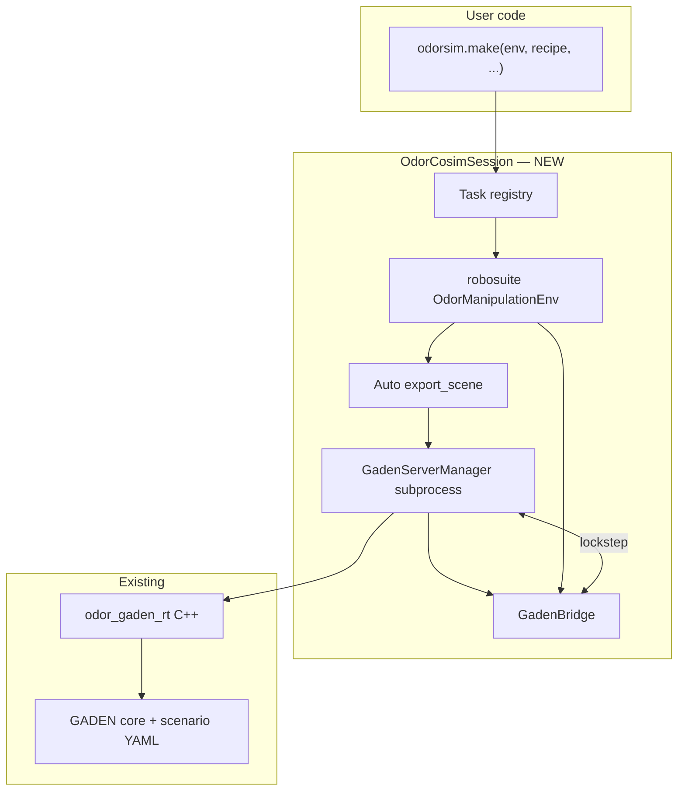

# OdorSim `make()` — Unified Co-Simulation Facade

## User vision (validated)

The desired user experience:

```python
import odor_sim as odorsim

cosim = odorsim.make(
    env="OdorLift",
    recipe="ripe_fruit",
    # optional: room size, robot, scenario overrides
)

obs = cosim.reset()
obs, reward, done, info = cosim.step(action)

# obs includes robosuite proprio/cameras + instruction + ppm at EE (optional voltage)
cosim.close()  # tears down MuJoCo env + GADEN server process
```

**Intent:** one call gives you **both** MuJoCo manipulation physics **and** a running GADEN plume server, already talking to each other. Task authors and data collectors swap `env=` / `recipe=` without learning ROS launch steps.

### Does this make sense?

**Yes, as a product/API design.** It matches how users expect simulators to work (cf. `gym.make`, `robosuite.make`) and hides the current three-terminal workflow:

1. `export_scene` → write GADEN YAML
2. `ros2 run odor_gaden_rt rt_server ...` → start C++ server
3. Python env + `GadenBridge` → lockstep co-simulation

### Is it possible?

**Yes, with important clarifications:**

| User mental model | Engineering reality |
|-------------------|---------------------|
| "`make()` includes MuJoCo **and** GADEN" | Two separate simulators behind **one Python facade**; not a single physics engine |
| "GADEN config comes from the env" | Env's `SceneBuilder` + `OdorProfile` **already** define sources (VOC types, strengths, object→source map); export is automatable |
| "CAD env from robosuite" | **Not automatic today.** robosuite uses `TableArena`; GADEN uses STL walls + wind YAML. Room alignment is via **FrameMap** + optional **generated or templated GADEN scenarios** — see §Room coupling |
| "No separate server" | Server remains a **subprocess** (`ros2 run odor_gaden_rt ...`); Python manages lifecycle (spawn, health-check, kill) |
| "`step()` runs everything" | `step()` = robosuite `env.step()` + bridge `step_env()` (source poses, `/gaden/step`, `/odor_value`) |

None of these block the design; they define scope for v1 vs v2.

---

## Current state (Phase 0–4, what exists)

### Already built — reuse, do not rewrite

| Component | Path | Role in `make()` |
|-----------|------|------------------|
| Task env base | `odor_sim/envs/base.py` | robosuite env + frame map + scene builder + pose APIs |
| Reference task | `odor_sim/envs/odor_lift.py` | First registered task |
| VOC recipes | `odor_sim/config/voc_recipes.yaml` | Emission strengths → GADEN `filamentPPMcenter` / `numFilaments_sec` |
| Scene export | `odor_sim/bridge/export_scene.py` | Writes `simulations/` + `scenes/<id>.yaml` from recipes |
| Bridge | `odor_sim/bridge/gaden_bridge.py` | Lockstep ROS client |
| RT server | `ros2_ws/src/odor_gaden_rt` | C++ GADEN wrapper |
| Teleop | `odor_sim/bridge/teleop.py` | Data collection (hardcoded `OdorLift` today) |
| Sensor model | `odor_sim/sensors/mox_pid.py` | Optional live/offline voltage from ppm |

### Current gaps vs unified `make()`

1. **No `odor_sim.make()`** — direct `OdorLift(...)` or incidental `robosuite.make("OdorLift")`.
2. **Manual GADEN launch** — user runs `rt_server` in another terminal.
3. **Manual export** — user runs `export_scene` before server start.
4. **Teleop not env-agnostic** — `TeleopSession` constructs `OdorLift` only.
5. **Room coupling is manual** — fixed `10x6_uniform` GADEN scenario + affine FrameMap; robosuite table size not driving GADEN CAD.
6. **No task registry** — no `ALL_ENVIRONMENTS`, no string→class map in OdorSim.

---

## Target architecture



### Core type: `OdorCosimSession` (name TBD)

Single object returned by `make()`:

```python
class OdorCosimSession:
    env: OdorManipulationEnv      # inner robosuite env
    bridge: GadenBridge           # ROS client (may share node with server manager)
    server: GadenServerProcess    # subprocess handle + logs

    def reset(self) -> dict: ...  # env.reset() + optional initial bridge sync
    def step(self, action) -> tuple: ...  # env.step + bridge.step_env → ppm in info/obs
    def close(self): ...          # env.close + bridge.close + server.terminate()
    def __enter__ / __exit__: ... # context manager
```

**Not** a subclass of robosuite env (composition over inheritance) so we don't fight robosuite's `EnvMeta` / `step` semantics.

### `make()` responsibilities (ordered)

1. **Resolve task** — `env="OdorLift"` → class + default kwargs from registry.
2. **Resolve scenario** — pick GADEN `scenarioPath` (default `10x6_uniform`, or generated room — §Room coupling).
3. **Construct robosuite env** — pass `scenario_config_dir`, `frame_map`, `recipe`, robot, table size, instruction.
4. **Export GADEN scene** — call `SceneBuilder.export_gaden_scene()` using **env's** `scene_builder` (not duplicate recipe list — **single source of truth**).
5. **Start `odor_gaden_rt`** — subprocess with `scenarioPath`, `sceneID`, lockstep (`stepOnTimer:=false`).
6. **Wait for ready** — `/odor_value` available, log line `odor_gaden_rt ready`.
7. **Connect bridge** — `GadenBridge.wait_for_server()`.
8. **Return** `OdorCosimSession`.

### Critical design rule: export from env, not from parallel recipe list

**Bug-prone pattern (today's CLI):** user passes `--recipe ripe_fruit` to `export_scene` separately from env construction.

**Correct pattern for `make()`:**

```python
env = OdorLift(recipe="ripe_fruit", ...)
env.scene_builder.export_gaden_scene(config_dir, scene_id=scene_id)
# source count/order guaranteed to match env.get_gaden_source_poses()
```

---

## Room coupling (robosuite ↔ GADEN CAD)

Three tiers; implement incrementally.

### Tier 1 — v1 (minimal, ship first)

- Fixed GADEN scenario: `scenarios/10x6_uniform/.../config1`.
- FrameMap anchors table center → point in GADEN room (existing defaults).
- Document workspace bounds; warn if mapped poses leave GADEN bounds.
- **User sees:** one `make()` call; room is still 10×6 m GADEN + small robosuite table embedded inside.

### Tier 2 — workspace-aware anchors (medium)

- `make(..., table_full_size=(1.2, 1.2, 0.05))` auto-computes FrameMap:
  - `robosuite_anchor` = table center
  - `gaden_anchor` = configurable or center of GADEN floor patch
- Validate corners with `frame_map.is_in_gaden_bounds()` after server preprocess (OccupancyGrid bounds available).

### Tier 3 — generated GADEN room from task spec (hard, v2+)

- Task declares `workspace_size=(L, W, H)` in meters.
- Tool generates or selects GADEN scenario:
  - box-room STL or reuse template scenario scaled to L×W
  - wind config snippet
  - `config.yaml` with matching bounds
- **Still two simulators**, but metric workspace ≈ GADEN floor footprint.

**Not in scope for v1:** automatic conversion of arbitrary MuJoCo meshes → GADEN occupancy grid.

---

## Proposed public API

### Registry

```python
# odor_sim/envs/registry.py
REGISTERED_TASKS = {
    "OdorLift": {
        "cls": OdorLift,
        "default_recipe": "ripe_fruit",
        "default_instruction": None,  # env generates
    },
    # future: "OdorPickPlace", "OdorSort", ...
}

def make(
    env: str,
    *,
    recipe: str | None = None,
    scenario: str = "10x6_uniform",      # logical name → path resolver
    scene_id: str | None = None,         # default: f"{env}_{recipe}"
    auto_start_gaden: bool = True,
    gaden_preprocessed: bool = True,       # wait for server ready
    bridge: bool = True,
    export_dir: str | None = None,       # default: scenario config dir
    server_log_dir: str | None = None,
    **env_kwargs,
) -> OdorCosimSession: ...
```

### Observations / info from `step()`

Extend robosuite obs (do not break VLA schema work in Phase 5):

```python
obs, reward, done, info = cosim.step(action)
info["ppm"] = {...}           # ground-truth per-gas at EE
info["sim_time"] = float
info["gaden_source_poses"] = ndarray
# Phase 5+: optional info["enose_voltage"] from sensors model
```

Or nested:

```python
info["odor"] = {"ppm": {...}, "sim_time": ..., "gas_types": [...]}
```

Decision deferred to Phase 5 SCHEMA.md — `make()` should expose ppm at minimum.

---

## GadenServerManager (new module)

```python
# odor_sim/runtime/gaden_server.py (proposed path)

class GadenServerManager:
    def __init__(self, scenario_path, scene_id, log_dir, ros_log_dir):
        ...

    def start(self, timeout=60) -> None:
        # subprocess: ros2 run odor_gaden_rt rt_server --ros-args ...
        # poll /odor_value or stdout for "odor_gaden_rt ready"

    def stop(self) -> None:
        # SIGTERM → wait → SIGKILL; cleanup temp scene if ephemeral

    @property
    def alive(self) -> bool: ...
```

**Implementation notes:**

- Source `setup/activate.sh` environment in subprocess **or** require user to call `make()` from activated shell (document both).
- Set `ROS_LOG_DIR` to writable path (sandbox/CI lesson).
- One server per `OdorCosimSession`; document limitation for parallel envs (ROS domain id / ephemeral configs).
- Optional: reuse existing server if `connect_only=True` for advanced users.

---

## Migration path for existing tools

| Tool | Change |
|------|--------|
| `tests/test_phase4_bridge.py` | Use `odorsim.make(..., connect_only=True)` or full make |
| `tests/test_phase4_teleop.py` | Same |
| `odor_sim/bridge/teleop.py` | Accept `cosim: OdorCosimSession` or `env=` string; drop hardcoded `OdorLift` |
| `export_scene` CLI | Keep as debug/manual tool; `make()` calls same code internally |
| Phase 5 recorder | Record from `cosim.step()` info |
| Phase 6 eval | `PolicyAdapter` + `cosim.step()` loop |

---

## Phased implementation plan (for agent)

### Phase 4.5a — Registry + `make()` without server (dry run)

**Deliverables:**

- `odor_sim/envs/registry.py` with `REGISTERED_TASKS`, `make_env()`.
- `odor_sim/make.py` exporting `make(..., auto_start_gaden=False)`.
- Export scene from `env.scene_builder` after env construct (no server).
- Test: `make("OdorLift")` → env loads, scene YAML written, source count matches.

**PASS:** pytest `tests/test_make_export.py` — 3/3 checks.

### Phase 4.5b — GadenServerManager subprocess

**Deliverables:**

- `odor_sim/runtime/gaden_server.py`.
- Start/stop rt_server; health check `/odor_value`.
- Test: manager alone starts server with pre-exported scene.

**PASS:** script starts server, `ros2 service list | grep odor_value`, clean shutdown.

### Phase 4.5c — OdorCosimSession full loop

**Deliverables:**

- Wire `make(auto_start_gaden=True)` → export + server + bridge.
- `reset()` / `step()` / `close()` context manager.
- Test: N steps, sim_time advances, ppm non-zero near source.

**PASS:** `tests/test_make_cosim.py` — 6/6 (mirror bridge test, no manual terminal).

### Phase 4.5d — Teleop + docs

**Deliverables:**

- `teleop --env OdorLift` uses `odorsim.make()`.
- README "Quick start" one-liner.
- Deprecate multi-terminal workflow in docs (keep advanced section).

**PASS:** human or scripted teleop episode with single command.

### Phase 4.5e — FrameMap helpers (optional Tier 2)

**Deliverables:**

- `FrameMap.from_table(table_full_size, table_offset, scenario_dir, gaden_anchor=...)`.
- Bounds validation helper on `OdorCosimSession.reset()`.

---

## Open questions (agent must decide or ask user)

1. **Ephemeral vs persistent export:** overwrite `rt_scene.yaml` each run, or write to `/tmp/odorsim_<hash>/`?
2. **Server reuse:** support attaching to already-running rt_server (`connect_only=True`)?
3. **Observation contract:** ppm in `info` vs extra obs keys vs both (Phase 5 alignment).
4. **Multi-env / vectorized:** explicitly unsupported in v1?
5. **Generated GADEN rooms (Tier 3):** template box room vs always 10×6 — user priority?
6. **Package export name:** `import odor_sim as odorsim` vs `from odor_sim import make` — pick one canonical style.

---

## Non-goals (v1)

- Merging MuJoCo and GADEN into one physics engine.
- Automatic STL extraction from robosuite TableArena.
- LeRobot dataset writer inside `make()` (Phase 5).
- Training / PolicyAdapter inside `make()` (Phase 6).
- RM65 robot port (orthogonal).

---

## Example target UX (end state)

```bash
source setup/activate.sh
python - <<'EOF'
import odor_sim as odorsim

with odorsim.make("OdorLift", recipe="ripe_fruit", has_renderer=True) as cosim:
    obs = cosim.reset()
    print(obs["instruction"])
    for _ in range(100):
        obs, r, done, info = cosim.step(cosim.env.action_spec.zeros())
        if info["ppm"]:
            print(info["ppm"])
EOF
```

Teleop:

```bash
python -m odor_sim.bridge.teleop --env OdorLift --recipe ripe_fruit
# internally: odorsim.make(...); no second terminal
```

---

## Success criteria

1. New user runs **one Python entry point** — no manual `export_scene` or `ros2 run` unless debugging.
2. Changing `env=` / `recipe=` regenerates GADEN scene and restarts server correctly.
3. Source index alignment **impossible to get wrong** (export always from env.scene_builder).
4. Existing Phase 4 tests pass when refactored to use `make()`.
5. Architecture doc stays compatible with Phase 5 dataset schema and Phase 6 eval harness.

---

## References in repo

| Topic | Path |
|-------|------|
| Master plan | `docs/gaden_robosuite_cosim_d067d61f.plan.md` |
| Env base | `odor_sim/envs/base.py` |
| Scene export | `odor_sim/envs/scene_builder.py`, `odor_sim/bridge/export_scene.py` |
| Bridge | `odor_sim/bridge/gaden_bridge.py` |
| RT server | `ros2_ws/src/odor_gaden_rt/` |
| Frame map | `odor_sim/config/frame_map.py` |
| VOC recipes | `odor_sim/config/voc_recipes.yaml` |

---

## Agent instruction block (copy-paste)

```
Implement OdorSim Phase 4.5 per docs/odorsim_make_unified_cosim.plan.md.

Constraints:
- Reuse Phase 4 bridge, export_scene logic, odor_gaden_rt unchanged if possible.
- Export GADEN scene from env.scene_builder after env construction (single source of truth).
- make() spawns rt_server subprocess, waits for /odor_value, wires GadenBridge.
- Composition: OdorCosimSession wraps env + bridge + server; do not subclass robosuite env for stepping.
- Deliver 4.5a→4.5d incrementally with tests after each sub-phase.
- Do not start Phase 5 (LeRobot writer) until user says "passed / go on".
- Match existing code style in odor_sim/; minimal scope per sub-phase.
```
