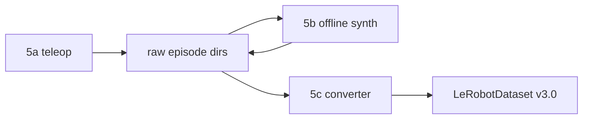

# Phase 5 — Dataset recording (planning)

## Decisions locked

| Item | Choice |
|------|--------|
| Cameras | `agentview` + `robot0_eye_in_hand`, 256×256 RGB |
| Pipeline | Two-stage: raw episodes → LeRobot converter |
| LeRobot | **>= 0.6.x**, **LeRobotDataset v3.0** |
| Voltage at mine time | No — offline only |

Capture contract: [SCHEMA.md](SCHEMA.md).

## Current baseline (already implemented)

[`odor_sim/bridge/teleop.py`](../odor_sim/bridge/teleop.py) via `odorsim.make()` records:

- `sim_time`, `ppm`, `action` (+ enose dim), `enose_state`, `sampling_active`, flat `state`
- `meta.json`: recipe, robots, control_freq, sample_hold_steps, success_hold_steps, success

**Missing for 5a:** camera frames, structured proprio, controller/scenario meta.

## Architecture



---

## Phase 5a — Mining superset

**Goal:** Extend `EpisodeRecorder` and teleop env config to capture the full
[SCHEMA.md](SCHEMA.md) superset per episode.

### Deliverables

1. **Env config for mining:** `has_offscreen_renderer=True`, `use_camera_obs=True`,
   `camera_names=['agentview', 'robot0_eye_in_hand']`, 256×256.
2. **Structured proprio extraction** from robosuite obs (joint pos/vel, EE pose, gripper).
3. **Frame storage:** per-episode `frames/` PNG dirs or stacked uint8 arrays in npz.
4. **Extended meta:** `controller_type`, `scenario`, `scene_id`.
5. **Headless path unchanged:** `run_scripted` / `tests/test_phase4_teleop.py` keep
   `use_camera_obs=False` (no renderer required).

### Files

- [`odor_sim/bridge/teleop.py`](../odor_sim/bridge/teleop.py) — recorder + env kwargs
- Optional: `odor_sim/bridge/recorder.py` if teleop.py grows too large

### PASS criteria

```bash
# Interactive: collect one episode with frames
python -m odor_sim.bridge.teleop --env OdorLift --recipe ripe_fruit --robots Panda \
  --camera agentview --device keyboard

# Verify episode dir has episode.npz, meta.json, frames/agentview/, frames/wrist/
# meta lists gas_types, robots, controller_type

# Headless regression
python tests/test_phase4_teleop.py   # 11/11
```

---

## Phase 5b — Offline feature synthesis

**Goal:** Batch CLI that reads raw episode dirs and writes `features.npz` +
`features_meta.json` using existing sensor code.

### Deliverables

1. **CLI:** `python -m odor_sim.recording.synthesize --episode-dir <path>`
   (or similar module path).
2. Uses [`synthesize_continuous`](../odor_sim/sensors/mox_pid.py),
   [`synthesize_sampling`](../odor_sim/sensors/mox_pid.py),
   [`SampleWindow`](../odor_sim/sensors/mox_pid.py) / `odor_class`.
3. **Re-runnable:** overwrite or version `features.npz`; sensor params in meta.
4. **Test:** `tests/test_phase5_synthesize.py` on a scripted episode fixture.

### PASS criteria

- Given an episode with ppm + enose_state, outputs continuous + sampling voltage arrays
- At least one `sample_windows` entry with `odor_class` when operator pressed sample
- Re-run with different MOX model params produces different voltage without re-mining

---

## Phase 5c — LeRobot v3.0 converter

**Goal:** `odor_sim/recording/` converts raw episode dirs to a loadable LeRobot dataset.

### Prerequisite

Upgrade lerobot in venv and pin in [`setup/requirements-sim.txt`](../setup/requirements-sim.txt):

```bash
pip install -U "lerobot>=0.6"
```

Smoke-test API:

```python
from lerobot.datasets.lerobot_dataset import LeRobotDataset
# LeRobotDataset.create(repo_id=..., fps=20, features={...})
# dataset.add_frame({...}); dataset.save_episode()
```

### Deliverables

1. **`LeRobotExporter`** (or `convert_episode`) in `odor_sim/recording/`.
2. **CLI:** `python -m odor_sim.recording.convert --input datasets/teleop --output <repo_id>`.
3. Maps [SCHEMA.md](SCHEMA.md) keys → LeRobot v3.0 features (chunked parquet + MP4).
4. **Test:** `tests/test_phase5_lerobot.py` — write one episode, load back, assert shapes.

### PASS criteria

- One teleop episode converts to LeRobot v3.0 on disk
- `LeRobotDataset(repo_id=...)` loads; frame count matches `num_steps`
- Images, state, action, task/instruction present

---

## Open questions (resolve during 5a/5c)

1. Store frames in npz vs PNG dirs vs both? (npz simpler for tests; PNG easier to inspect)
2. LeRobot `repo_id` local path convention (`datasets/lerobot/<name>`)?
3. Include continuous voltage in `observation.state` at convert time, or keep odor channels separate for ablations?

## Non-goals

- Training / SmolVLA / pi0 fine-tune
- RM65 robot
- Depth cameras
- Hugging Face Hub upload (optional later)
- Isaac Sim port

## Agent instruction block

```
Implement OdorSim Phase 5 per docs/phase5_recording.plan.md and docs/SCHEMA.md.

Constraints:
- Two-stage pipeline: raw episodes first, LeRobot converter second.
- No voltage at mine time; use odor_sim/sensors for 5b.
- LeRobotDataset v3.0 via lerobot >= 0.6.
- Deliver 5a -> 5b -> 5c incrementally with tests after each sub-phase.
- Do not start Phase 6 until user says "passed / go on".
```
